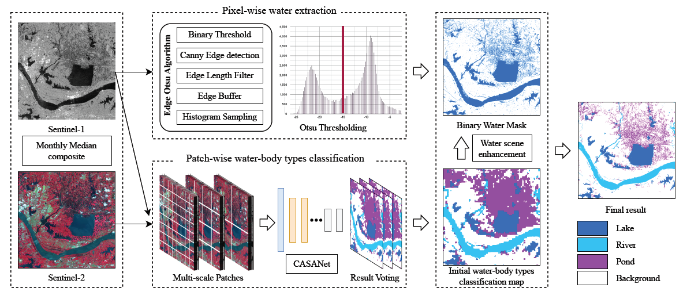
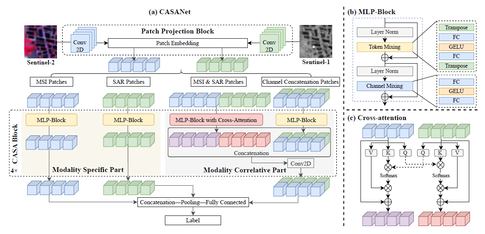

This repository is for our JSTARS(2024) paper "Refined Water-Body Types Mapping Using a Water-Scene Enhancement Deep Models by Fusing Optical and SAR Images". We will publish our code and data soon.
# WSEDM

# CASANet

If it is helpful for you, please cite the following references.

@article{ma2024refined,
  title={Refined Water-Body Types Mapping Using a Water-Scene Enhancement Deep Models by Fusing Optical and SAR Images},
  author={Ma, Haozheng and Yang, Xiaohong and Fan, Runyu and Han, Wei and He, Kang and Wang, Lizhe},
  journal={IEEE Journal of Selected Topics in Applied Earth Observations and Remote Sensing},
  year={2024},
  publisher={IEEE}
}
